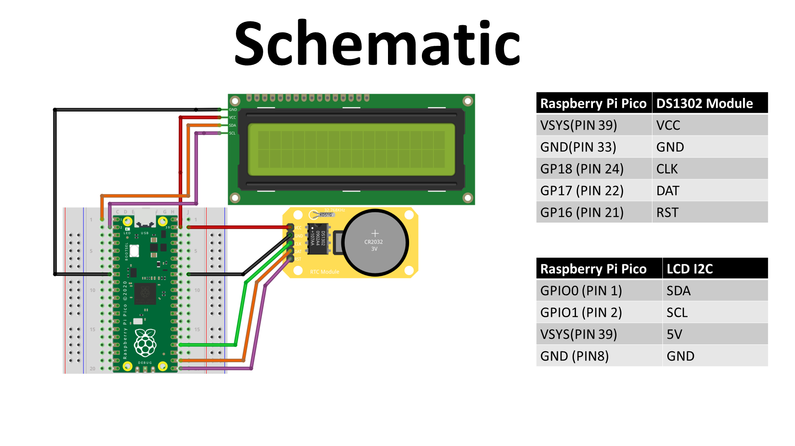

# DS1302 +  16x2 Character LCD 

This tutorial we will take a look at the **DS1302** real-time clock module. We will connect it to the Raspberry Pi Pico to display the date and time on the popular **16x2 Character LCD with I2C**.

## DS1302

The DS1302 trickle-charge timekeeping chip contains a real-time clock/calendar and 31 bytes of static RAM. It communicates with a microprocessor via a simple serial interface. The real-time clock/calendar provides seconds, minutes, hours, days, dates, months, and year information.

## Components Required

To follow along with this tutorial, you will need the following components:
-   Raspberry Pi Pico
-   16x2 Character LCD
-   The DS1302 module also ensures that you have a 1.5V cell.

## Schematic Diagram

## Libraries

RPI-PICO-I2C-LCD - https://github.com/T-622/RPI-PICO-I2C-LCD
DS1302 RTC Clock driver - https://github.com/omarbenhamid/micropython-ds1302-rtc
